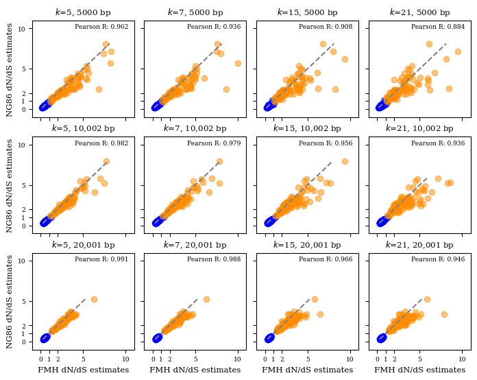
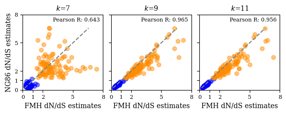
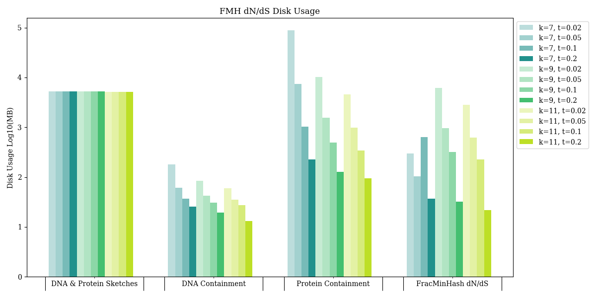
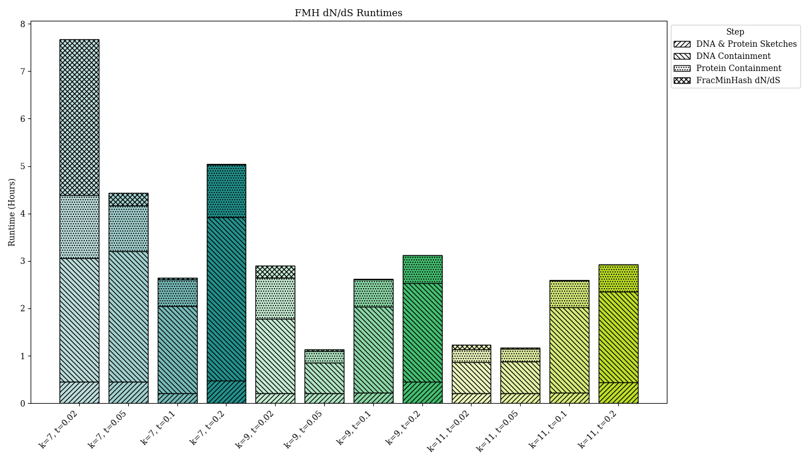

# This repo is for the reproducibles of manuscript on fmh dnds

# Table of Contents

- [Environment setupe](#Environment-Setup)
    - [Conda](#Conda-environment)
    - [Pip](#Pip-environment)
- [Datasets](#Datasets)
    - [Simulated data](#simulated-data)
    - [GTDB](#GTDB)
- [Reproduce](#Reproduce)
    - [Simulations](#Simulations) 
    - [FracMinHash dN/dS estimations](#fracminhash-dnds-estimations)
    - [Traditional dN/dS model estimations](#traditional-dnds-models)
    - [Main figures](#main-figures)
    - [Supplemental figures](#supplemental-figures)
- [References](#references)
- [Please, cite us!](#please-cite-us)

# Environment setup

Create either a conda or pip environment to reproduce this figure.

## Conda environment

```
conda env create -f environment.yml
conda activate reproduce
```

## Pip environment

```
python3 -m venv reproduce_pip_env
source reproduce_pip_env/bin/activate
pip install -r requirements.txt
```

# Datasets 

## Simulated data

You can download our simulated dataset for this manuscript here: [simulation datasets](https://github.com/KoslickiLab/dnds_using_fmh_reproducibles/blob/main/helper_scripts/simulate/README.md)

## Genome Taxonomy Database download 

In our validation of FracMinHash dN/dS, we use representative genome sequence data from the Genome Taxonomy Database (Release 214). These are big files so make sure you have space! Please follow the following instructions to obtain these files.

```
# Download amino acid sequences
wget https://data.ace.uq.edu.au/public/gtdb/data/releases/release214/214.0/genomic_files_reps/gtdb_proteins_aa_reps_r214.tar.gz

# Download protein-coding sequences
wget https://data.ace.uq.edu.au/public/gtdb/data/releases/release214/214.0/genomic_files_reps/gtdb_proteins_nt_reps_r214.tar.gz

# Extract
tar -xvzf gtdb_proteins_aa_reps_r214.tar.gz
tar -xvzf gtdb_proteins_nt_reps_r214.tar.gz
```

# Reproduce 

## Simulations

While using a scale factor of 1, we produce FracMinHash dN/dS estimation employing varying k-sizes to compare with the traditional dn/ds model, NG86. Please follow instructions here to generate these and more simulations.

## FracMinHash dN/dS estimations


## Traditional dN/dS model estimations

From the simulated sequences, produce an AXT from FASTA file and apply KaKs_Calculator [1] on generated AXT dataset.

```
python helper_scripts/mutation_simulation_on_random_data/apply_kaks_calculator_on_random_sequence.py
```

## Main figures

These are the scripts to generate the main figures of our manuscript.

### Figure 2

Figure 2A represents how well FracMinHash dN/dS estimations are being made when compared to the traditional dN/dS model, NG86, on random sequences. Additionally, the figure compares varying k-sizes and sequence lengths. Please execute the following command to produce the figure for random sequence simulations.

```
python figure_scripts/figure2a.py
```



Similar to Figure 2A, Figure 3b represents how well FracMinHash dN/dS estimations are being made when compared to the traditional dN/dS model, NG86, but this time we run simulations on a real sequence. The figure also compares varying k-sizes. Please execute the following command to produce the figure for a real sequence simulations.

```
python figure_scripts/figure2b.py
```



### Figure 3

Figure 3A represents disk usage when running FracMinHash dN/dS on varying k-sizes and scale factors at different steps.

```
python figure_scripts/disk_usage_figure.py
```



Figure 3B represents runtimes when running FracMinHash dN/dS on varying k-sizes and scale factors. Additionally, the time is takes to run each step and the program in total is also shown.

```
python figure_scripts/runtimes_stackplot_figure.py
```



### Figure 4

### Figure 5

To reproduce Figure 5A, the hierarchical edge bundling figure, please refer to the following repo: [Hierarchichal Edge Bundling](https://github.com/KoslickiLab/DnDs-visualization)


## Supplemental figures

Figure 6:

    python helper_scripts/mutation_simulation_on_random_data/histogram_kaks_test.py

Figure 7:

    python helper_scripts/mutation_simulations_on_real_data/histogram_different_scales_ecoli.py

# References

[1] Zhang, Z., Li, J., Zhao, X.-Q., Wang, J., Wong, G. K.-S., & Yu, J. (2006). KaKs_Calculator: Calculating Ka and Ks through model selection and model averaging. Genomics, Proteomics & Bioinformatics, 4(4), 259–263. Oxford University Press.

# Please, cite us!

Leveraging FracMinHash Containment for Genomic dN /dS. Judith S. Rodriguez, Mahmudur Rahman Hera, and David Koslicki. In preparation.