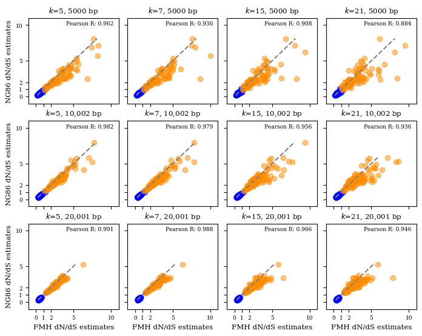
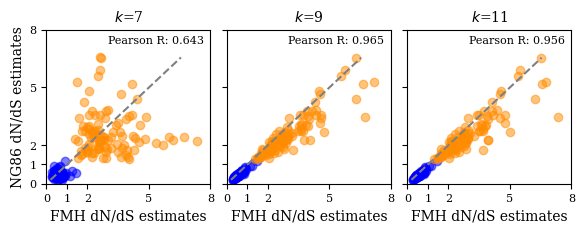

# This repo is for the reproducibles of manuscript on fmh dnds

# Table of Contents

# Environment setup

# Simulation dataset generation:

Generate random sequences:


Apply mutation on real sequences:


From the simulated random sequences, produce an AXT from FASTA file and apply KaKs_Calculator on generated AXT dataset.

    python helper_scripts/mutation_simulation_on_random_data/apply_kaks_calculator_on_random_sequence.py

# Main figures

These are the scripts to generate the main figures of our manuscript.

## Figure 2

Figure 2A represents how well FracMinHash dN/dS estimations are being made when compared to the traditional dN/dS model, NG86, on random sequences. Additionally, the figure compares varying k-sizes and sequence lengths. Please execute the following command to produce the figure for random sequence simulations.

```python figure_scripts/figure2a.py```



Similar to Figure 2A, Figure 3b represents how well FracMinHash dN/dS estimations are being made when compared to the traditional dN/dS model, NG86, but this time we run simulations on a real sequence. The figure also compares varying k-sizes. Please execute the following command to produce the figure for a real sequence simulations.

```python figure_scripts/figure2b.py```



Figure 3A

    python figure_scripts/disk_usage_figure.py

Figure 3B

    python figure_scripts/runtimes_stackplot_figure.py

## Figure 5

### Figure 5 (Panel A): Hierarchical Edge Bundling Figure

To reproduce hierarchical edge bundling figure, please refer to the following repo: [Hierarchichal Edge Bundling](https://github.com/KoslickiLab/DnDs-visualization)


# Supplemental figures

Figure 6:

    python helper_scripts/mutation_simulation_on_random_data/histogram_kaks_test.py

Figure 7:

    python helper_scripts/mutation_simulations_on_real_data/histogram_different_scales_ecoli.py
