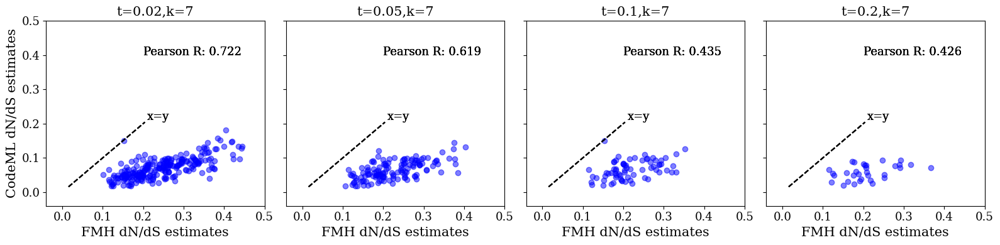
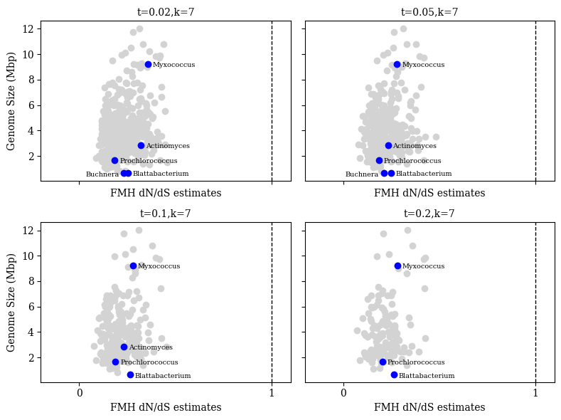
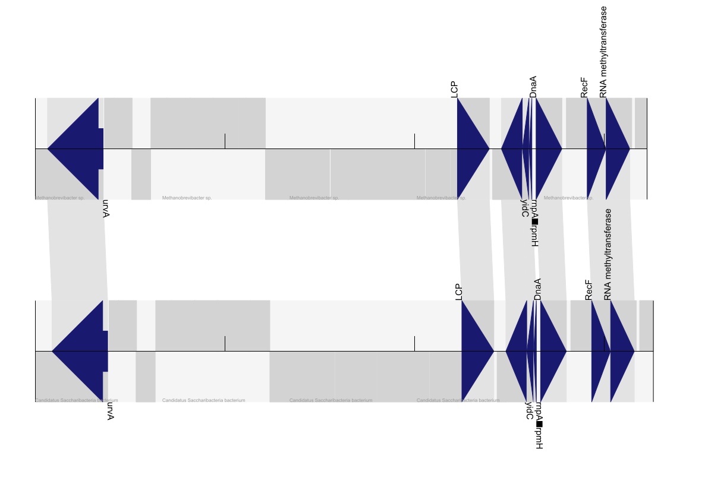
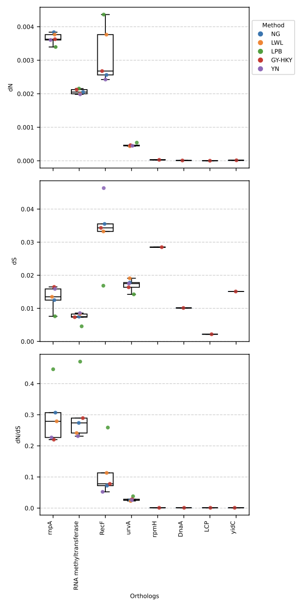

# This repo is for the reproducibles of manuscript on fmh dnds

# Table of Contents

- [Environment setup](#Environment-Setup)
    - [Conda](#Conda-environment)
    - [Pip](#Pip-environment)
- [Quick start](#quick-start)
- [Datasets](#Datasets)
    - [Simulated data](#simulated-data)
    - [GTDB](#Genome-Taxonomy-Database-download)
    - [Martinez-Gutierrez,2022](#martinez-gutierrez-2022-dataset)
- [Reproduce](#Reproduce)
    - [Simulations](#Simulations) 
    - [FracMinHash dN/dS estimations](#fracminhash-dnds-estimations)
    - [Traditional dN/dS model estimations](#traditional-dnds-models)
    - [Main figures](#main-figures)
    - [Supplemental figures](#supplemental-figures)
- [References](#references)
- [Please, cite us!](#please-cite-us)

# Environment setup

Create either a conda or pip environment to reproduce this figure.

## Conda environment

```
conda env create -f environment.yml
conda activate reproduce
```

## Pip environment

```
python3 -m venv reproduce_pip_env
source reproduce_pip_env/bin/activate
pip install -r requirements.txt
```

# Quick start

To quickly start reproducing figures from our maanuscript, execute the following bash script. Please note that simulated data generated from our lab cannot be downloaded from this bash script, currently.

<!--MAKE SURE BASH SCRIPT INCLUDES A PLACE TO DOWNLOAD OUR DATA TOO-->

```
bash data_download.sh
```

# Datasets 

## Simulated data

You can download our simulated dataset for this manuscript here: [simulation datasets](https://github.com/KoslickiLab/dnds_using_fmh_reproducibles/blob/main/helper_scripts/simulate/README.md)

## Genome Taxonomy Database download 

In our validation of FracMinHash dN/dS, we use representative genome sequence data from the Genome Taxonomy Database (Release 214). These are big files so make sure you have space! Please follow the following instructions to obtain these files.

```
# Download amino acid sequences
wget https://data.ace.uq.edu.au/public/gtdb/data/releases/release214/214.0/genomic_files_reps/gtdb_proteins_aa_reps_r214.tar.gz

# Download protein-coding sequences
wget https://data.ace.uq.edu.au/public/gtdb/data/releases/release214/214.0/genomic_files_reps/gtdb_proteins_nt_reps_r214.tar.gz

# Extract
tar -xvzf gtdb_proteins_aa_reps_r214.tar.gz
tar -xvzf gtdb_proteins_nt_reps_r214.tar.gz
```

## Martinez-Gutierrez (2022) dataset

We were able to compare our FracMinHash dN/dS estimaions of GTDB representative genomes by comparing them to a published dataset [2]. Martinez-Gutierrez (2022) obtained values using a maximum-likelihood model (CodeML), and genus-level median dN/dS estimates were related to genome size to study gene loss [2]. Visit Martinez-Gutierrez publication for this and other supplemental information here: https://journals.plos.org/plosgenetics/article?id=10.1371/journal.pgen.1010220#sec013  

```
# Download TSV file for dN/dS estimations from Martinez-Gutierrez (2022) [2]
wget https://doi.org/10.1371/journal.pgen.1010220.s002
```

# Reproduce 

## Simulations

While using a scale factor of 1, we produce FracMinHash dN/dS estimation employing varying k-sizes to compare with the traditional dn/ds model, NG86. Please follow instructions here to generate these and more simulations.

## FracMinHash dN/dS estimations


## Traditional dN/dS model estimations

From the simulated sequences, produce an AXT from FASTA file and apply KaKs_Calculator [1] on generated AXT dataset.

```
python helper_scripts/mutation_simulation_on_random_data/apply_kaks_calculator_on_random_sequence.py
```

## Main figures

These are the scripts to generate the main figures of our manuscript.

### Figure 2: Selection simulations

Figure 2A represents how well FracMinHash dN/dS estimations are being made when compared to the traditional dN/dS model, NG86, on random sequences. Additionally, the figure compares varying k-sizes and sequence lengths. Please execute the following command to produce the figure for random sequence simulations.

```
python figure_scripts/figure2a.py
```


Similar to Figure 2A, Figure 3b represents how well FracMinHash dN/dS estimations are being made when compared to the traditional dN/dS model, NG86, but this time we run simulations on a real sequence. The figure also compares varying k-sizes. Please execute the following command to produce the figure for the real sequence simulations.

```
python figure_scripts/figure2b.py
```


### Figure 3: Disk usage and runtimes

Figure 3A represents disk usage when running FracMinHash dN/dS on varying k-sizes and scale factors at different steps.

```
python figure_scripts/disk_usage_figure.py
```


Figure 3B represents runtimes when running FracMinHash dN/dS on varying k-sizes and scale factors. Additionally, the time it takes to run at each step and the program in total is also shown.

```
python figure_scripts/runtimes_stackplot_figure.py
```


### Figure 4: Comparing FracMinHash dN/dS results to published data

Ensure to have this dataset in your working directory! 

To compare FracMinHash dN/dS estimaions of GTDB representative genomes to a real world research question, check back to the [Martinez-Gutierrez,2022](#martinez-gutierrez-2022-dataset) section and download the Martinez-Gutierrez (2022) dataset!

Figure 4A compares estimations made by FracMinHash dN/dS to an implemented maximum likelihood model, CodeML. 

```
python figure_scripts/figure4a.py 
```



Figure 4B evaluates the interpretations made by FracMinHash dN/dS when compared to genus genome size.

```
python figure_scripts/figure4b.py 
```




### Figure 5: Identifying regions under selection between Methanobrevibacter sp. and Candidatus Saccharibacteria

Hierarchical edge bundling visualization of pairwise selection between archaeal and bacterial genomes. B. Orthologous genes identified and annotated between Methanobrevibacter sp. and Candidatus Saccharibacteria. Genes including uvrA, LytR/CpsA/Psr (LCP), yidC, rnpA, rpmH, dnaA, and RNA methyltransferases appear in conserved order across both genomes. This arrangement suggests a vertically inherited genomic island maintained across archaeal and bacterial domains. Gene order and synteny support the functional conservation of this region. C. 

To reproduce Figure 5A, the hierarchical edge bundling figure, please refer to the following repo: [Hierarchichal Edge Bundling](https://github.com/KoslickiLab/DnDs-visualization)


Figure 5B represents the identification of orthologous genes identified and annotated between Methanobrevibacter sp. and Candidatus Saccharibacteria. 

```
python figure_scripts/figure5b.py
```



Figure 5C shows results when performing traditional dN/dS analyses to study selection across evaluated orthologs.

Please visit [instructions to Figure 5c](figure_scripts/figure5c/) for reproducibility.



## Supplemental figures

Figure 6:

    python helper_scripts/mutation_simulation_on_random_data/histogram_kaks_test.py

Figure 7:

    python helper_scripts/mutation_simulations_on_real_data/histogram_different_scales_ecoli.py

# References

[1] Zhang, Z., Li, J., Zhao, X.-Q., Wang, J., Wong, G. K.-S., & Yu, J. (2006). KaKs_Calculator: Calculating Ka and Ks through model selection and model averaging. Genomics, Proteomics & Bioinformatics, 4(4), 259–263. Oxford University Press.

[2] Martinez-Gutierrez, C. A., & Aylward, F. O. (2022). Genome size distributions in bacteria and archaea are strongly linked to evolutionary history at broad phylogenetic scales. PLoS Genetics, 18(5), e1010220.

# Please, cite us!

Leveraging FracMinHash Containment for Genomic dN /dS. Judith S. Rodriguez, Mahmudur Rahman Hera, and David Koslicki. In preparation.