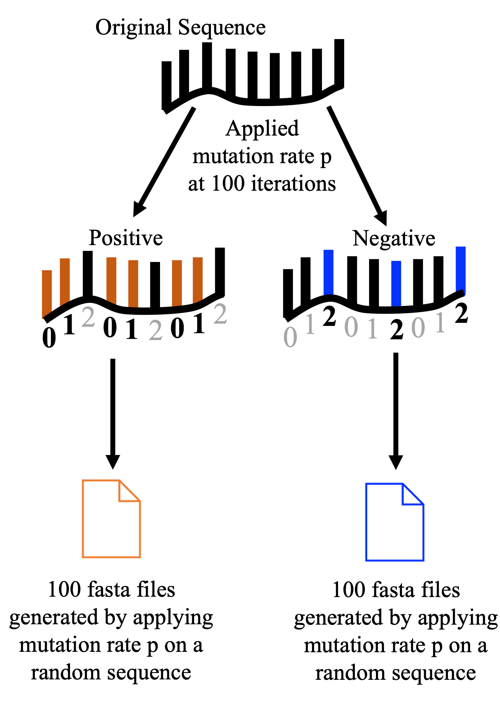

# Generate simulated datasets for FracMinHash dN/dS validation

In our manuscript, we validated that FracMinHash was producing the correct inference of selection, that is, positive or negative selection by generating simulations on a random sequence. This simulation is based off of the suggestion that 5% and 72% of synonymous mutations occur in the first and third position of the codon [1]. Please follow the instructions below to start simulating positive and negative selection!



# Table of Contents

- [Environment setup](#environment-setup)
- [Datasets](#datasets)
- [Quick start](#quick-start)
- [Usage](#usage)

# Environment setup

Before simulating selected sequences, you'll need to set up an environment. Please find instructions here: [Environment setup](https://github.com/KoslickiLab/dnds_using_fmh_reproducibles/tree/main#Environment-Setup)

# Datasets 

In our manuscript, we used a scale factor of 1 and varying k-sizes to validate that FracMinHash dN/dS is accurately estimating selection and to compare with the traditional dn/ds model results. Please find the datasets we have used for our manuscript here: XYZ

# Quick start

While using a scale factor of 1, we produce FracMinHash dN/dS estimation employing varying k-sizes to compare with the traditional dn/ds model, NG86. You can run the following script to quickly obtain these simulations or follow instructions under [usage](#usage) to generate these and more simulations.

```
bash simulation_job.sh
```

# Usage

To generate a simulated sequence of 5000 nulcoetides at a mutation rate of 0.01, execute the following command.

```
# Random sequence 5,000 nucleotides in length and a mutation rate (p) of 0.01
python random_selection_simulation.py --len 5000 --prate 0.01 --wd ../
```

Play around with your simulation and feel free to change the mutation rate. In the following, I do just that by changing it to 0.1 and 0.001.

```
# Change p-rate to 0.1
python random_selection_simulation.py --len 5000 --prate 0.1 --wd ../
# Change p-rate to 0.001
python random_selection_simulation.py --len 5000 --prate 0.001 --wd ../
```

| Argument | Description |
|---|---|
| len | Sequence length (positive integer). |
| prate | Mutation rate p in [0,1]. |
| wd | Indicate working directory for output |

# Output

This script produces 6 files.

| Filename | Description |
|---|---|
| ref_{len}.fna | The random nucleotide created. This is our reference sequence. The {len} indicates the length of the nucleotide sequence created. |
| ref_translated_{len}.faa | The protein translation of the random nucleotide created. |
| positive_selection_queries_{len}_{prate}.fna | Positive selection was applied on the nucleotide reference using a mutation p rate of {prate}. |
| positive_selection_translated_queries_{len}_{prate}.faa | The positive selected nucleotide sequence was translated to a protein sequence.  |
| negative_selection_queries_{len}_{prate}.fna | Negative selection was applied using the same mutation p rate. |
| negative_selection_translated_queries_{len}_{prate}.faa | The negative selected nucleotide sequence was translated to a protein sequence. |

# References

[1] Nei, M., & Gojobori, T. (1986). Simple methods for estimating the numbers of synonymous and nonsynonymous nucleotide substitutions. Molecular Biology and Evolution, 3(5), 418–426.