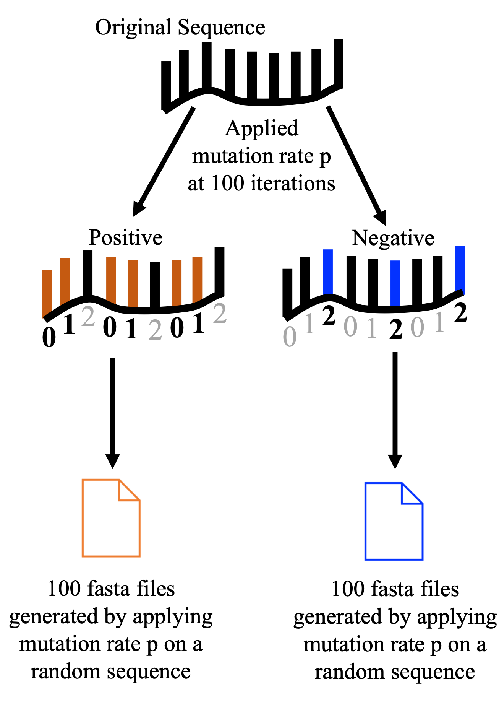

# Generate simulated datasets for FracMinHash dN/dS validation

In our manuscript, we validated that FracMinHash was producing the correct inference of selection, that is, positive or negative selection by generating simulations on a random sequence. This simulation is based off of the suggestion that 5% and 72% of synonymous mutations occur in the first and third position of the codon [1]. Please follow the instructions below to start simulating positive and negative selection!



# Table of Contents

- [Environment setup](#environment-setup)
- [Datasets](#datasets)
- [Quick start](#quick-start)
- [Usage](#usage)
- [Output](#output)
- [Reference](#references)

# Environment setup

Before simulating selected sequences, you'll need to set up an environment. Please find instructions here: [Environment setup](https://github.com/KoslickiLab/dnds_using_fmh_reproducibles/tree/main#Environment-Setup)

# Datasets 

In our manuscript, we used a scale factor of 1 and varying k-sizes to validate that FracMinHash dN/dS is accurately estimating selection and to compare with the traditional dn/ds model results. Please find the results present in our manuscript here: [datasets](https://github.com/KoslickiLab/dnds_using_fmh_reproducibles/tree/main/data/figure2_datasets)

For additional datasets, please reach out to us!

# Quick start

While using a scale factor of 1, we produce FracMinHash dN/dS estimation employing varying k-sizes to compare with the traditional dn/ds model, NG86. You can run the following script to quickly obtain these simulations (random, real sequence, and real genome) or follow instructions under [usage](#usage) to generate these and more simulations.

```
bash simulation_job.sh
```

# Usage

## Random Selection on Random Sequences

To generate a simulated sequence of 5000 nucleotides at a mutation rate of 0.01, execute the following command.

```
# Random sequence 5,000 nucleotides in length and a mutation rate (p) of 0.01
python random_selection_simulation.py --len 5000 --prate 0.01 --wd ../
```

Play around with your simulation and feel free to change the mutation rate. In the following, I do just that by changing it to 0.1 and 0.001.

```
# Change p-rate to 0.1
python random_selection_simulation.py --len 5000 --prate 0.1 --wd ../
# Change p-rate to 0.001
python random_selection_simulation.py --len 5000 --prate 0.001 --wd ../
```

| Argument | Description |
|---|---|
| len | Sequence length (positive integer). |
| prate | Mutation rate p in [0,1]. |
| wd | Indicate working directory for output |

## Random Selection on Real Sequences

Similarly, you can generate negative and positive selection on a real gene sequence and genome by using the following commands.

| Argument | Description |
|---|---|
| prate | Mutation rate p in [0,1]. |
| wd | Indicate working directory for output |

For the LAMA3 gene sequence (also known as K06240), execute the following commands to obtain selection using a mutation p rate of 0.1, 0.01, and 0.001. Feel free to change the '--prate'.

```
# Change p-rate to 0.1
python produce_selection_on_sequence.py --prate 0.1 --wd ../
# Change p-rate to 0.01
python produce_selection_on_sequence.py --prate 0.01 --wd ../
# Change p-rate to 0.001
python produce_selection_on_sequence.py --prate 0.001 --wd ../
```

Lastly, generated random negative and positive selection on the E. coli genome using the following command:

```
# Change p-rate to 0.1
python produce_selection_on_genome.py --prate 0.1 --wd ../
# Change p-rate to 0.01
python produce_selection_on_genome.py --prate 0.01 --wd ../
# Change p-rate to 0.001
python produce_selection_on_genome.py--prate 0.001 --wd ../
```

# Output

## Output for Random Sequences 

Our random sequence simulation was tested on 6 files. The above script produces 6 files:

| Filename | Description |
|---|---|
| ref_{len}.fna | The random nucleotide created. This is our reference sequence. The {len} indicates the length of the nucleotide sequence created. |
| ref_translated_{len}.faa | The protein translation of the random nucleotide created. |
| positive_selection_queries_{len}_{prate}.fna | Positive selection was applied on the nucleotide reference using a mutation p rate of {prate}. |
| positive_selection_translated_queries_{len}_{prate}.faa | The positive selected nucleotide sequence was translated to a protein sequence.  |
| negative_selection_queries_{len}_{prate}.fna | Negative selection was applied using the same mutation p rate. |
| negative_selection_translated_queries_{len}_{prate}.faa | The negative selected nucleotide sequence was translated to a protein sequence. |

## Output for Real Sequences 

The LAMA3 reference was used to evaluate our method and the above script produces 4 files.

| Filename | Description |
|---|---|
| positive_selection_queries_{mutation_rate_p}_K06240.fna | Positive selection was applied on the real reference using a mutation p rate of {prate}. |
| negative_selection_queries_{mutation_rate_p}_K06240.fna | Negative selection was applied on the real reference using a mutation p rate of {prate}. |
| positive_selection_translated_queries_{mutation_rate_p}_K06240.faa | The positive selected real sequence was translated to a protein sequence.  |
| negative_selection_translated_queries_{mutation_rate_p}_K06240.faa | The negative selected real sequence was translated to a protein sequence.  |

Same with the LAMA3 reference, here we wanted to test a longer dataset and chose the E. coli genome. The above script produces 4 files. 

| Filename | Description |
|---|---|
| positive_selection_queries_{mutation_rate_p}_{i}.fna | Positive selection was applied on the genome reference using a mutation p rate of {prate}. With 100 iterations, each being {i}. |
| negative_selection_queries_{mutation_rate_p}_{i}.fna | Negative selection was applied on the genome reference using a mutation p rate of {prate}. With 100 iterations, each being {i}. |
| positive_selection_translated_queries_{mutation_rate_p}_{i}.faa | The positive selected genome sequence was translated to a protein sequence. With 100 iterations, each being {i}. |
| negative_selection_translated_queries_{mutation_rate_p}_{i}.faa | The negative selected genome sequence was translated to a protein sequence. With 100 iterations, each being {i}. |


Note: the red sequence is the first entry in the FASTA files.

# References

[1] Nei, M., & Gojobori, T. (1986). Simple methods for estimating the numbers of synonymous and nonsynonymous nucleotide substitutions. Molecular Biology and Evolution, 3(5), 418–426.